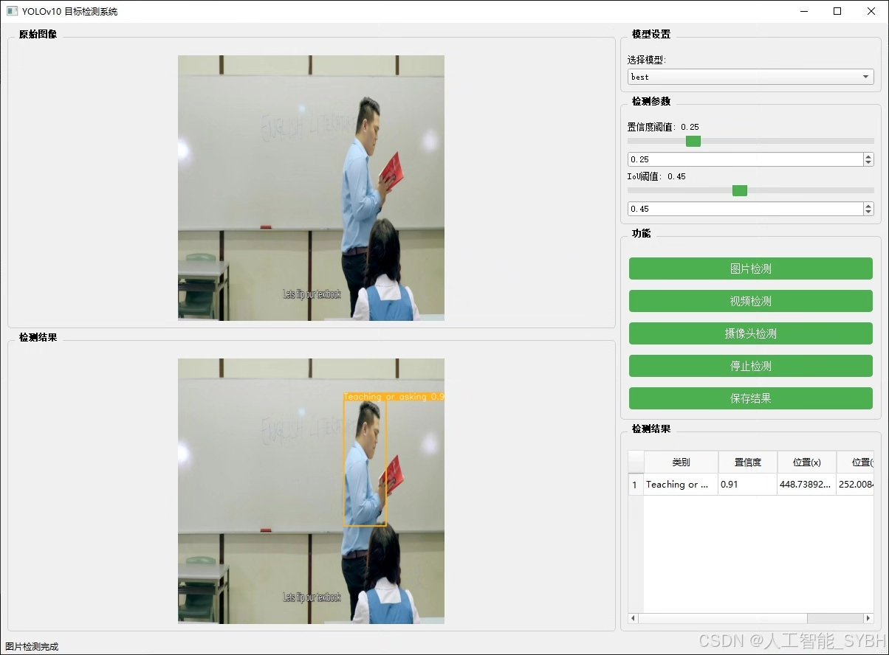
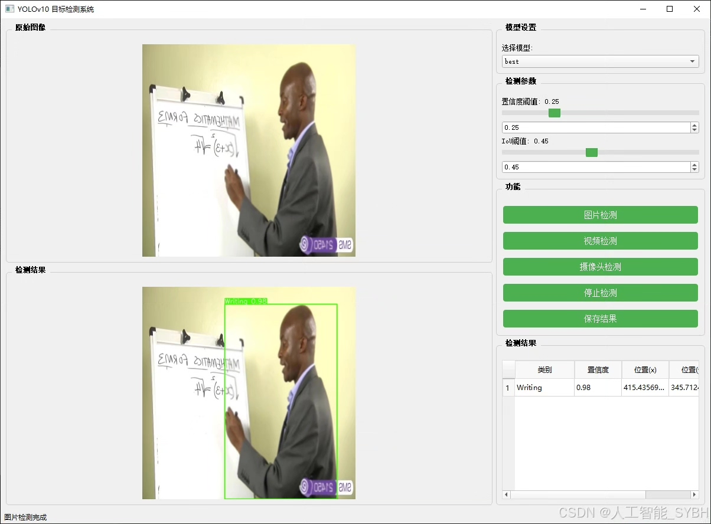
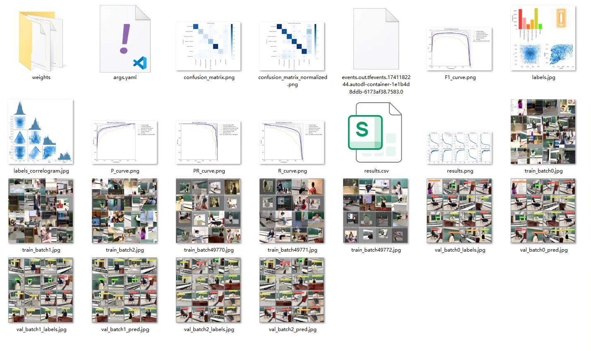
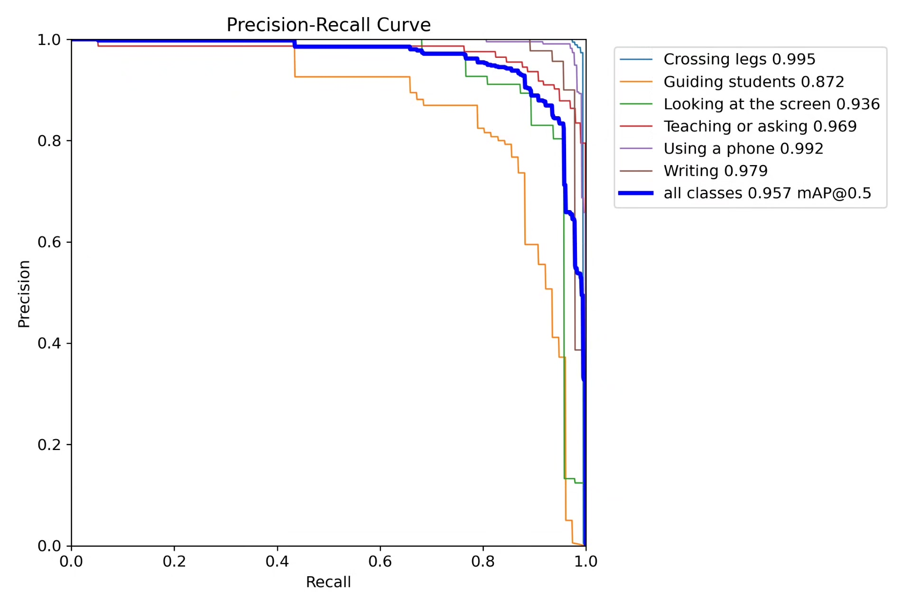
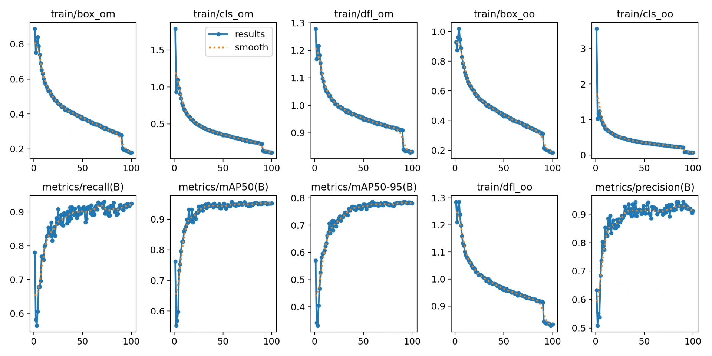
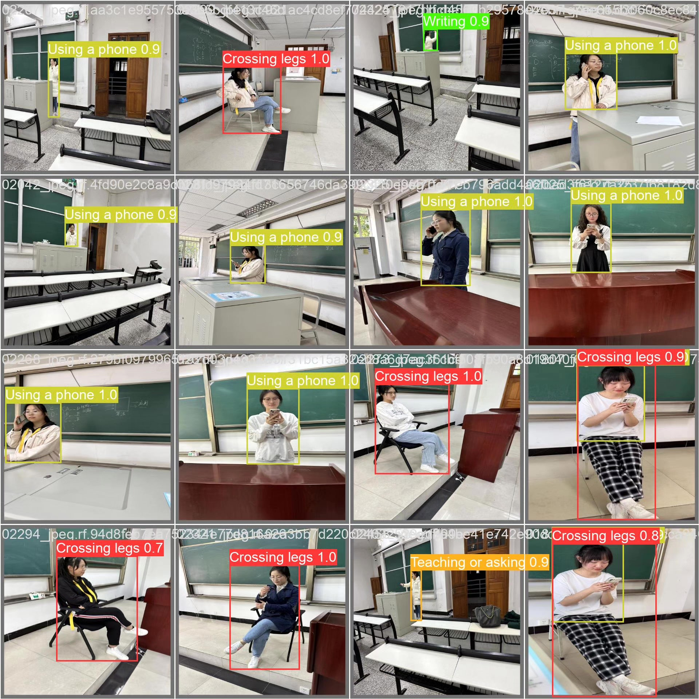

# Based on YOLOv10 deep learning for teacher classroom behavior detection system

## Body

Based on the YOLOv10 deep learning, a teacher classroom behavior detection system (YOLOv10+YOLO dataset + UI interface + Python project source code + model)

As the latest version of the YOLO series, YOLOv10 has higher detection speed and accuracy, which is very suitable for the application of teacher behavior detection scenarios. The purpose of this project is to use the YOLOv10 algorithm, combined with the teacher behavior dataset, to develop a high-efficiency and accurate behavior detection system, providing technical support for teaching quality management and educational research.

The company's products have obtained the official commercial license certification of YOLO.

Package after-sales service: After payment, we will provide WeChat IDs, answering questions anytime.

Environment configuration: We will provide an environment configuration tutorial, and WeChat provides Q&A.
Remote installation service: If you need remote configuration, an additional fee of 69 is required,
If the configuration fails, all fees are refunded (specially for old computers only refund installation fees).

Retraining dataset: After configuring the environment, you can train on your own computer.
If you need us to retrain, just pay 69 + computing power fees (2.5 yuan/hour)

Full package after-sales service

## Images

## Payment

Here is a pay link on Stripe ( https://buy.stripe.com/3cs8yP7sY87d0vu9AB ). Please contact me lonlonago@foxmail.com after funding $89, and I will send you a complete data files , thank you!

